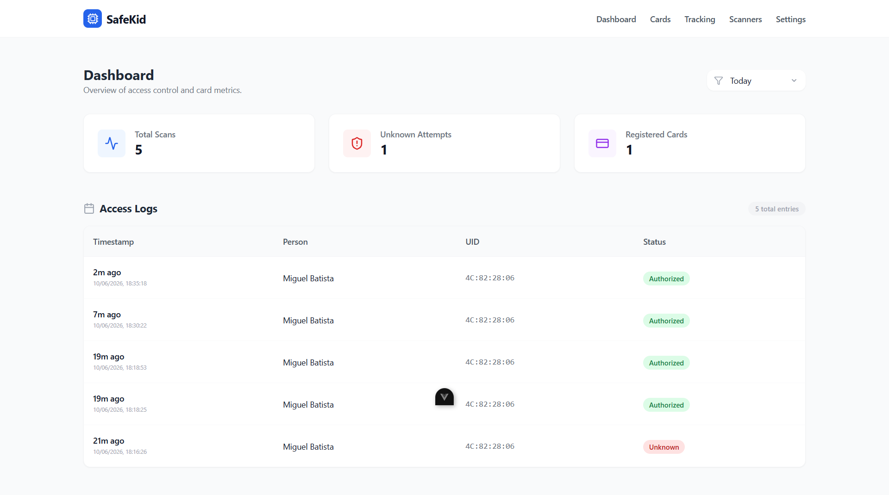
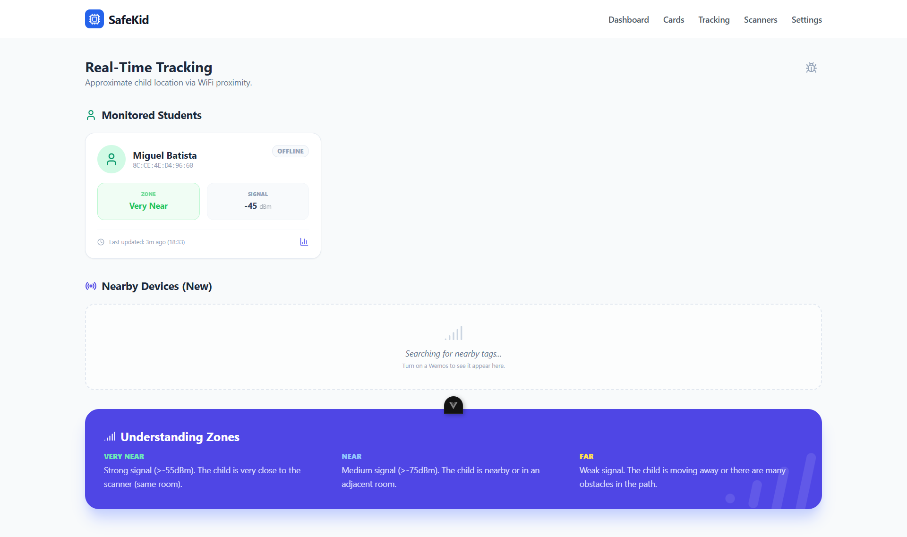
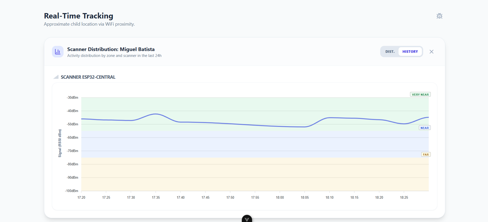
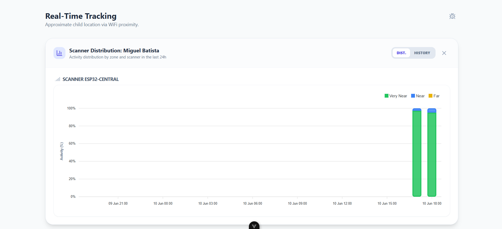
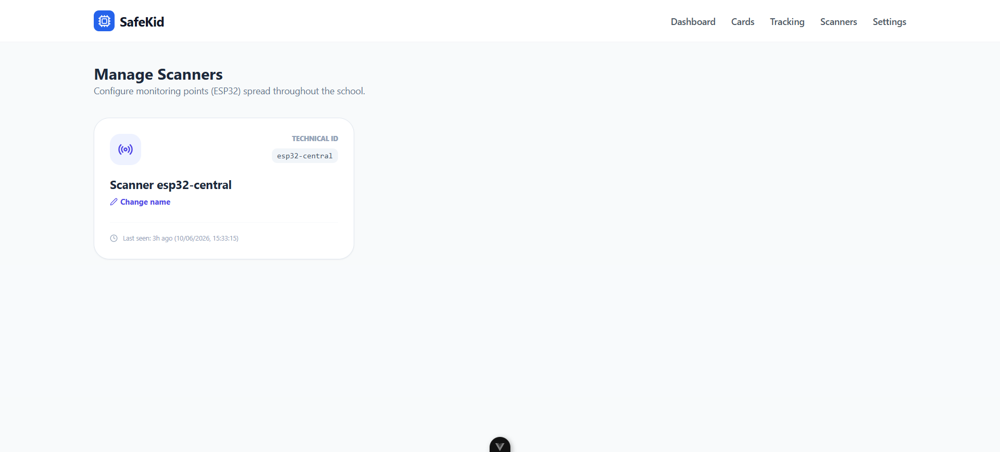
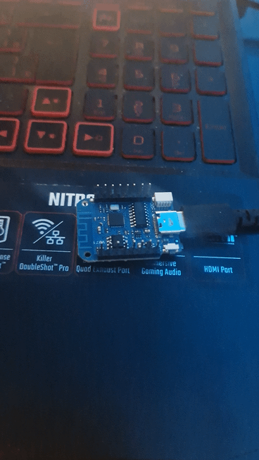
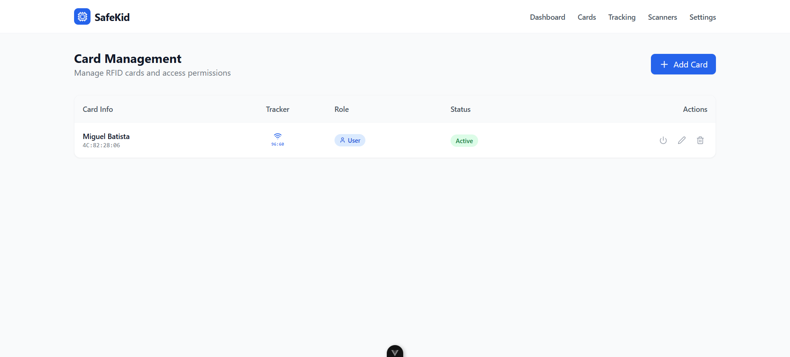
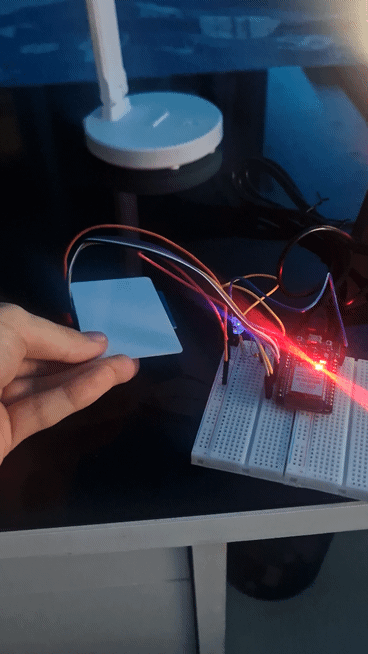

# SafeKid-IoT 🛡️ 👦

Sistema inteligente de monitoramento e controle de acesso para proteção de crianças em ambientes educacionais e institucionais.

---

## 📌 Objetivo e Motivação

O projeto **SafeKid-IoT** nasceu da necessidade de aumentar a segurança de crianças em escolas e creches. Utilizando tecnologia IoT (Internet das Coisas), o sistema permite o monitoramento em tempo real de acessos e a localização aproximada de alunos dentro de zonas monitoradas, oferecendo tranquilidade aos responsáveis e uma gestão eficiente para a instituição.

### Principais Benefícios:
- **Segurança Proativa**: Identificação instantânea de acessos não autorizados.
- **Rastreamento em Tempo Real**: Localização por zonas (Perto, Muito Perto, Longe) via RSSI.
- **Gestão Simplificada**: Registro e controle de crachás RFID através de uma interface web moderna.

---

## 🚀 Como Funciona?

O ecossistema SafeKid opera em uma malha de dispositivos inteligentes:

1.  **Captura de Dados (Edge)**: Dispositivos ESP32 atuam como leitores RFID (entrada/saída) e como **Sniffers** de proximidade.
2.  **Tecnologia de Rastreamento**: As tags WiFi/Bluetooth portadas pelas crianças emitem um "heartbeat" periódico. Os scanners capturam esse sinal e medem sua intensidade (**RSSI**).
3.  **Estimativa de Distância**: O sistema calcula a distância com base na atenuação do sinal. Ao espalhar múltiplos scanners pela escola (Salas, Pátio, Refeitório), é possível mapear por onde a criança andou e em qual zona ela se encontra no momento.
4.  **Processamento**: O protocolo **MQTT** garante a entrega rápida dos dados ao backend **FastAPI**, que processa as métricas e gerencia a lógica de acesso.
5.  **Visualização**: O Dashboard em **Vue 3** refina esses dados brutos em gráficos e tabelas compreensíveis.

---

## 📸 Demonstração Detalhada

### 1. Dashboard de Controle
Central de comando que exibe métricas críticas do dia, como total de acessos e tentativas desconhecidas. Permite uma auditoria rápida do fluxo de entrada e saída.

### 2. Monitoramento em Tempo Real
Exibe o status atual de cada aluno (Online/Offline) e sua localização estimada.

### 3. Gráficos Analíticos de Atividade
O sistema gera visualizações para entender o comportamento de movimento e segurança:

| **Curva de Intensidade (RSSI)** | **Distribuição por Zonas** |
| :--- | :--- |
| Mostra a variação da força do sinal ao longo do tempo. Além de indicar aproximação, esta curva permite identificar **períodos suspeitos**: por exemplo, a detecção de sinais (mesmo em zona 'Far') fora do horário de aula ou em áreas restritas, auxiliando na prevenção de incidentes. | Gráfico de barras empilhadas que quantifica o tempo de permanência em cada zona (Perto, Muito Perto, Longe) por scanner, permitindo analisar quais ambientes a criança mais frequenta durante o dia. |
|  |  |

### 4. Gestão de Dispositivos (Scanners)
Controle de todos os pontos de acesso ESP32. Aqui é possível renomear scanners e verificar sua última atividade na rede.

### 5. Descoberta de Tags (Sniffer)
Demonstração do ESP32 identificando tags próximas através do "heartbeat". O sistema calcula a distância instantaneamente conforme o sinal é captado.

*O scanner detecta o MAC da tag e estima a distância via RSSI em tempo real.*

### 6. Gerenciamento de Alunos e Crachás
Interface para vincular UIDs de cartões RFID a nomes de alunos e configurar permissões de acesso.

### 7. Validação de Acesso
Processo de leitura de cartão RFID. O sistema valida o UID no banco e responde via MQTT para destravar (ou não) o acesso físico.

*Acesso autorizado com feedback imediato no hardware e log instantâneo no dashboard.*

---

## 🛠️ Stack Tecnológica

-   **Frontend**: Vue 3 (Composition API), Vite, Tailwind CSS, TanStack Query, Lucide Icons, ApexCharts.
-   **Backend**: FastAPI, SQLAlchemy (ORM), Paho-MQTT, Pydantic.
-   **Firmware**: C++, PlatformIO, Arduino framework.
-   **Infraestrutura**: Broker Mosquitto (MQTT), SQLite.

---

## 📂 Estrutura do Projeto

-   `/backend`: API REST e serviços de monitoramento.
-   `/frontend`: Aplicação Web Vue 3.
-   `/firmware`: Código fonte para ESP32 e dispositivos Wemos.
-   `/docs`: Documentação técnica de hardware e planejamento.
-   `/scripts`: Scripts utilitários para seed de dados e upload de firmware.

---

## 🔗 Links Importantes

-   📄 [Artigo Completo do Projeto](https://docs.google.com/document/d/1ThVJpRU6ZdF_nexUTVyQ8nrOvbpMcFH3iXfswhdYLAI/edit?usp=sharing)
-   🏗️ [Esquemático ESP32 (Web)](https://app.cirkitdesigner.com/project/96b2e6a2-5b4b-4bac-97d2-bae0015d09af)
-   🔌 [Mapeamento de Pinos ESP32](docs/MAPEAMENTO_ESP32.md)
-   🗺️ [Plano de Implementação (Master Plan)](docs/MASTER_PLAN.md)

---

## 🛠️ Instalação e Execução

Consulte os READMEs específicos em cada pasta para instruções detalhadas de configuração:
- [Guia do Backend](backend/README.md)
- [Guia do Frontend](frontend/README.md)

---

Desenvolvido com ❤️ para a segurança de quem mais importa.
